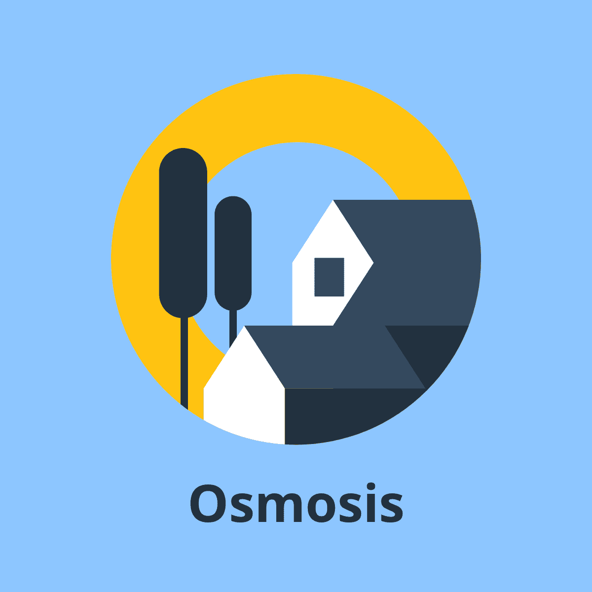

# Osmosis Server

See the [spec repo](https://github.com/neelkamath/osmosis-spec) for the specs on things like the DB schema. The prototype may not follow the spec to the dot.

**For Passengers**

For BMTC passengers who need better bus systems, Osmosis is an app that prevents conductors from making petty thefts, provides real time bus routes, and provides cashless transactions. Unlike the existing BMTC app, our product saves time and money.

**For Administrators**

For BMTC administrators who need to effectively plan bus routes, Osmosis is an admin panel that provides analytics such as heatmaps for identifying planning efficiency during rush hour, and charts for viewing trends. Unlike the current BMTC system, our product provides deep actionable insights from data that isn’t incorrectly collected from negligent bus conductors.

## Installation

1. Set up the [dependencies](docs/dependencies.md).
1. Optionally, generate a client SDK for the HTTP API using [OpenAPI Generator](https://openapi-generator.tech/) on the file https://raw.githubusercontent.com/neelkamath/backend-prototype/master/docs/openapi.yaml.

## Usage

### [Documentation](https://neelkamath.gitlab.io/osmosis-server/)

### [Running the Server](docs/production.md)

## Contributing

### Installation

1. Clone the repository using one of the following methods.
    - SSH: `git clone git@github.com:neelkamath/backend-prototype.git`
    - HTTPS: `git clone https://github.com/neelkamath/backend-prototype.git`
1. Set up the [dependencies](docs/dependencies.md).
1. Install the latest [node.js LTS](https://nodejs.org/en/download/).
1. Set up the CI/CD pipeline.
    1. Create a [GitLab account](https://gitlab.com/users/sign_up).
    1. [Connect](https://docs.gitlab.com/ee/ci/ci_cd_for_external_repos/github_integration.html) the GitHub repo to a GitLab repo.
1. Set up [ngrok](https://dashboard.ngrok.com/).
1. Optionally, generate a server stub for the HTTP API using [OpenAPI Generator](https://openapi-generator.tech/) on the file https://raw.githubusercontent.com/neelkamath/backend-prototype/master/docs/openapi.yaml.

### [Developing](docs/developing.md)

## License

This project is under the [MIT License](LICENSE).